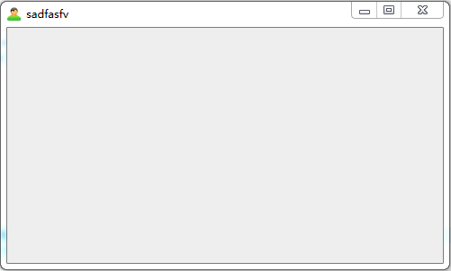
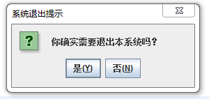

#图形用户界面心得笔记
##@Author LinZeng

GUI开发的一般步骤
>1. 创建顶层窗体（如JFrame或其子类对象）；
>2. 向窗体添加相应的中间组件和基本组件，并设置这些组件的相关属性；
>3. 设置布局管理策略，指定添加的组件在窗体上的位置
>4. 添加事件处理

<br />
<br />
###一、顶层容器----窗口
1. 用于创建窗口的组件：JWindow和JFrame

2. 一般创建窗体和窗体使用的步骤

>1. 该类继承自类JFrame
2. 设置窗体标题   ______super(title)继承父类\\setTitle(title)
3. 设置窗体大小 ______setSize(width,height)
4. 设置屏幕居中显示 ______x=(screenWidth-width)/2;y=(screenHeight-height)/2.
5. 创建图标对象和设置窗体图标_____创建图标见代码，设置setIconImage(img);
6. 设置关闭按钮操作(让操作界面可关闭)____setDefaultCloseOperation(JFrame.DISPOSE_ON_CLOSE);
7. 设置窗体可见____setVisible(true);

图形界面如下：


```java
class MyFrame extends JFrame {
    public MyFrame() {
        this("学生管理系统");
    }
    
    public MyFrame(String title) {
        super(title);       //设置窗体标题
        setSize(500,300);   //设置窗体大小
        //屏幕居中显示
        Dimension size = Toolkit.getDefaultToolkit().getScreenSize();
        int screenWidth = size.width;
        int screenHeight = size.height;
        int x = (screenWidth - this.getWidth())/2;
        int y = (screenHeight - this.getHeight())/2;
        this.setLocation(x,y);
        //创建图表对象
        Image img = Toolkit.getDefaultToolkit().getImage(this.getClass().getResource("main.png"));
        this.setIconImage(img);
        //设置关闭按钮操作
        this.setDefaultCloseOperation(JFrame.DISPOSE_ON_CLOSE);
        this.setVisible(true);      //设置窗体可见
    }
}
```


<br />
<br />
###二、对话框

1. javax.swing包主要提供了JDialog和JOptionPane来定义对话框
  JDialog主要用于创建自定义的对话框
  **JOptionPane主要用于创建各种标准的对话框 **（主要介绍）
  功能：主要用于显示提示信息或接受用户输入

2. JOptionPane对话框主要定制下列四种标准对话框

>- 确认对话框(ConfirmDialog)——————一般4个参数
- 输入文本对话框(InputDialog)————————7
- 消息对话框(MessageDialog)————————2
- 组合消息框(OptionDialog)————————8
这四个对话框可以采用showXXXDialog()来显示

- 确认对话框
1参： 一般null,所属窗体
2参： 提示信息
3参： 对话框标题
4参： 按钮类别————JOptionPane.YES_NO_OPTION

- 组合对话框（1-4参同上）
5参： 图标类型————JoptionPane.QUESTION_MESSAGE
6参： null，采用默认图标
7参： 选项内容
8参： 默认选项（option[1]）

- 消息对话框(1-2参同上)

- 输入对话框(1-3参同上)
4参： 对话框类型 JoptionPane.PLAIN_MESSAGE(没图标)
5参： null，采用默认图标
6参： 选项内容
7参： 默认选项

图形界面如下：

(1)确认对话框

(2)组合对话框

(3)消息对话框

(4)输入对话框

```java
public class L09_02JOpDemo {
    public static void main(String[] args) {
        //1.确认对话框
        int answer = JOptionPane.showConfirmDialog(null,//所属窗体
                            "你确实需要退出本系统吗？",  //提示信息
                            "系统退出提示",   //对话框标题
                            JOptionPane.YES_NO_OPTION);  //按钮类别
        if(answer == JOptionPane.YES_OPTION) {  } //关闭窗体
        //2.组合对话框
        Object[] option = {"确定","取消","帮助"};
        answer = JOptionPane.showOptionDialog(null,
                        "你确定要退出系统吗",
                        "系统退出提示", 
                        JOptionPane.YES_NO_CANCEL_OPTION,
                        JOptionPane.QUESTION_MESSAGE,
                        null,
                        option,
                        option[1]);
        if(answer == JOptionPane.YES_OPTION) {}
        if(answer == JOptionPane.NO_OPTION ) {System.exit(0);}      //输入对话框按取消，退出系统
        if(answer == JOptionPane.CANCEL_OPTION) {
            JOptionPane.showMessageDialog(null, "我能帮助你什么？","帮助",JOptionPane.QUESTION_MESSAGE);
        }
        //3.消息对话框
        JOptionPane.showMessageDialog(null, "学生信息管理系统 V1.1。"
                + "\n 指导老师： 张永昌，胡菊新，康晓峰。"
                + "\n 作者： 软件1班第2小组。"
                + "\n 完成日期： 2012-11-8");
        //4.输入对话框
        Object[] choices = {"关闭计算机","重新启动","注销","切换用户","睡眠"};
        String choiceAnswer = (String)JOptionPane.showInputDialog(null,
                "请选择关机类型",
                 "关机选项",
                 JOptionPane.PLAIN_MESSAGE,
                 null,
                 choices,
                 choices[1]);
        if(choiceAnswer == null ) {System.exit(0);}     //输入对话框按取消，退出系统
        JOptionPane.showMessageDialog(null, "你的关机选项为：【"+choiceAnswer+"】");
    }
}
```


<br />
<br />
###三、常用组件--（JLabel, JTextField, JPasswordField, JButton, JComboBox）

**实例：登录窗体**
1. 创建步骤

>1. 声明组件
 ---private JLabel accountLb1,passwordLb1,roleLb1;
>2. 创建窗体
 ---见一（窗体创建）
>3. 创建界面元素
 ---accountLb1 = new JLabel("用户账号:");
>4. 布局
 ---setLayout(null);    //设置布局为空布局
>5. 将组件添加到顶层窗体
 ---add(accountLb1);
>6.显示窗体
 ---setVisible(true);

2. 窗体操作工具类介绍WindowUtils
 
>1. 居中方法 displayOnDesktopCenter(JFrame frame)
2. 在和某个类对象同一个目录下的图片对象-返回ImageIcon
---public static ImageIcon getImageIcon(Object classObj,String picname)
>3. 在和某个类对象同一个目录下的图片对象-返回Image

图形界面如下：


```java
public class J09_03Loginqq extends JFrame{
    //声明各个界面元素
    private JLabel accountLbl,passwordLbl;
    private JLabel imageLbl;
    private JTextField accountField;
    private JPasswordField passwordField;
    private JButton enterButton;
    public J09_03Loginqq(String title) {
        //创建框体
        setTitle(title);
        setSize(380,160);
        WindowUtils.displayOnDesktopCenter(this);
        setResizable(false);
        //创建界面元素
        accountLbl = new JLabel("注册账号");
        accountField = new JTextField(20);
        passwordLbl = new JLabel("找回密码");
        passwordField = new JPasswordField(20);
        enterButton = new JButton("登录");
        imageLbl = new JLabel();
        imageLbl.setIcon(new ImageIcon("src/images/123.jpg"));
        //布局
        setLayout(null);
        imageLbl.setBounds(20,10,100,100);
        accountField.setBounds(140,10,140,20);
        accountLbl.setBounds(280,10,60,20);
        passwordField.setBounds(140,40,140,20);
        passwordLbl.setBounds(280,40,60,20);
        enterButton.setBounds(140,80,140,20);
        //将组件添加到顶层窗体中
        add(accountField);
        add(accountLbl);
        add(passwordField);
        add(passwordLbl);
        add(enterButton);
        add(imageLbl);
        //可视化
        setVisible(true);
    }
}
```


```java
public class WindowUtils {
    public static void displayOnDesktopCenter(JFrame frame) {
        //窗体居中
        Dimension dim = Toolkit.getDefaultToolkit().getScreenSize();
        int screenWidth = dim.width;
        int screenHeight = dim.height;
        int w = frame.getWidth();
        int h = frame.getHeight();
        int x = (screenWidth - w)/2;
        int y = (screenHeight - h)/2;
        frame.setLocation(x,y);
    }
       //在和某个类对象同一个目录下的图片对象-返回ImageIcon
       public static ImageIcon getImageIcon(Object classObj,String picname){ 
           return new javax.swing.ImageIcon(classObj.getClass().getResource(picname)); 
       }
       
       //在和某个类对象同一个目录下的图片对象-返回Image
       public static Image getImage(Object classObj,String picname){
           Image img = Toolkit.getDefaultToolkit().getImage(classObj.getClass().getResource(picname));  
           return img;
       }
}
```


<br />
<br />
###四、菜单和工具栏

**1. 菜单**

- 菜单分下拉式(pulldown)和弹出式(popup)两种
- **下拉式用JMenuBar实现**，弹出式用JPopupMenu实现
- 菜单组件分为三类：**JMenuBar(菜单栏)**、**JMenu(菜单)**、**JMenuItem(菜单项)**
- **首先将JMenuItem添加到JMenu,然后将JMenu添加到JMenuBar中，最后把JMenuBar添加到容器中**
- 菜单可以添加分割线addSeparator();
- 菜单项可以添加注册监听器，设置菜单快捷键

界面如下：


*代码见2.工具栏*

**2. 工具栏**

**工具栏对应的按钮组件只显示图标，不显示文字信息，但当鼠标移到图标上时会显示提示信息**

- 工具栏也可以添加分割线
- setToolTipText()显示提示信息

界面如下：


```java
public class L09_04_Admin extends JFrame implements ActionListener{
    //定义菜单栏变量
    private JMenuBar menuBar;
    //定义菜单变量：系统管理、学生管理、课程管理、成绩管理、教师管理
    private JMenu sysMenu,stuMenu,cMenu,scoreMenu,tMenu;
    //菜单项：系统管理--学院设置、专业设置、密码修改、退出
    private JMenuItem dItem,mItem,pwdItem,exitItem;
    public L09_04_Admin(String account) {
        setTitle("学生信息管理系统"+"，当前管理员为："+account);        //设置窗体标题
        setSize(500,300);                                           //设置窗体大小
        WindowUtils.displayOnDesktopCenter(this);                   //屏幕居中显示
        setDefaultCloseOperation(JFrame.DISPOSE_ON_CLOSE);          //正常关闭窗体
        createMenu();                                               //添加菜单
        showToolBar();                                              //添加工具栏
        setVisible(true);                                           //显示窗体
    }
    //创建菜单
    public void createMenu() {
        menuBar = new JMenuBar();   //创建菜单栏
        //系统管理菜单及菜单项的创建
        sysMenu = new JMenu("系统管理");
        dItem = new JMenuItem("学院设置");
        mItem = new JMenuItem("专业设置");
        pwdItem = new JMenuItem("密码修改");
        exitItem = new JMenuItem("退出");
        exitItem.setIcon(new ImageIcon("src/images/main.png"));         //插入图像的典型方法！！！！
        exitItem.addActionListener(this);       //注册监听器
        exitItem.setMnemonic('Q');              //为“退出”菜单设置快捷键
        sysMenu.add(dItem);                     //开始讲菜单项添加到系统管理菜单中
        sysMenu.add(mItem);
        sysMenu.addSeparator();                 //添加分割线
        sysMenu.add(pwdItem);
        sysMenu.addSeparator();
        sysMenu.add(exitItem);
        menuBar.add(sysMenu);                   //将系统管理菜单添加到菜单栏中
        //其他菜单及菜单项的创建
        stuMenu = new JMenu("学生管理");
        cMenu = new JMenu("课程管理");
        scoreMenu = new JMenu("成绩管理");
        tMenu = new JMenu("教师管理");
        menuBar.add(stuMenu);
        menuBar.add(cMenu);
        menuBar.add(scoreMenu);
        menuBar.add(tMenu);
        this.setJMenuBar(menuBar);              //把菜单与窗体关联即添加到窗体中
    }
    
    //对菜单系统管理的菜单项exit所注册的监听器中的方法做实现
    public void actionPerformed(ActionEvent e) {
        if(e.getSource() == exitItem) {
            System.exit(1);         //即退出程序
        }
    }
    
    //设置工具栏的方法(ToolBar)
    public void showToolBar() {
        JToolBar jt = new JToolBar();       //创建工具栏
        //创建系统设置按钮
        JButton sys_setBtn = new JButton(WindowUtils.getImageIcon(this, "sys_set.png"));
        sys_setBtn.setToolTipText("系统设置");
        JButton score_queryBtn = new JButton(WindowUtils.getImageIcon(this, "score_query.png"));
        score_queryBtn.setToolTipText("成绩查询");
        JButton stuinf_inputBtn = new JButton(WindowUtils.getImageIcon(this, "stuinf_input.png"));
        stuinf_inputBtn.setToolTipText("学生信息录入");
        JButton sys_exitBtn = new JButton(WindowUtils.getImageIcon(this, "sys_exit.png"));
        sys_exitBtn.setToolTipText("退出系统");
        jt.add(sys_setBtn);
        jt.addSeparator();
        jt.add(score_queryBtn);
        jt.addSeparator();
        jt.add(stuinf_inputBtn);
        jt.addSeparator();
        jt.add(sys_exitBtn);
        this.add(jt,BorderLayout.NORTH);
        
    }
    
    public static void main(String[] args) {
        new L09_04_Admin("admin");
    }
}
```


<br />
<br />
###五、布局管理器

1. **java.awt提供的布局管理器类包括FlowLayout(流式布局)、BorderLayout(边界布局)、GridLayout(网格布局)、CardLayout(卡片布局)、null(空布局)--通过setBounds(int,int,int,int)来实现布局(左上点横坐标,左上点纵坐标,宽度,高度)**

界面如下：

1流式布局

```java
public class L09_06FlowLayoutDemo {
    public static void main(String[] args) {
        JFrame jFrame = new JFrame("FlowLayout流式布局演示");
        FlowLayout flowLayout = new FlowLayout(0,10,10);
        jFrame.setLayout(flowLayout);
        for(int i = 0; i < 6; i++) {
            jFrame.add(new JButton("按钮"+i));
        }
        jFrame.setSize(750,200);
        WindowUtils.displayOnDesktopCenter(jFrame);
        jFrame.setVisible(true);
    }
}
```


2边界布局

```java
public class L09_07BorderLayoutDemo {
    public static void main(String[] args) {
        JFrame jf = new JFrame("BorderLayout边界布局演示");   //创建一个顶层容器框架
        BorderLayout borderLayout = new BorderLayout(10,10);
        jf.setLayout(borderLayout);
        jf.add(BorderLayout.NORTH,new JButton("north"));
        jf.add(BorderLayout.SOUTH,new JButton("south"));
        jf.add(BorderLayout.EAST,new JButton("east"));
        jf.add(BorderLayout.WEST,new JButton("west"));
        jf.add(BorderLayout.CENTER,new JButton("center"));
        jf.setSize(250,250);
        jf.setVisible(true);
    }
}

```


3网格布局

```java
public class L09_08GridLayoutDemo {
    public static void main(String[] args) {
        JFrame jf = new JFrame("GridLayout网格布局演示");
        //创建GridLayout的对象，并把容器划分为3行3列的矩形网格，水平和垂直间距为5
        GridLayout grid = new GridLayout(3,3,5,5);
        jf.setLayout(grid);
        for(int i = 0; i < 9; i++) {
            jf.add(new JButton("按钮" + i));
        }
        jf.setSize(250,250);
        jf.setVisible(true);
    }
}

```


4卡片布局

```java
public class L09_09CardLayoutDemo extends JFrame implements ActionListener{
    JPanel centerPanel = new JPanel();
    JPanel southPanel = new JPanel();
    JButton firstButton = new JButton("首页");
    JButton nextButton = new JButton("下一页");
    JButton prevButton = new JButton("上一页");
    JButton lastButton = new JButton("尾页");
    CardLayout cardLayoutManager = new CardLayout(5,5);
    public L09_09CardLayoutDemo() {
        super("CardLayout卡片布局演示");
        centerPanel.setSize(280,160);
        centerPanel.setLayout(cardLayoutManager);       //设为卡片布局
        centerPanel.add("card1",new JButton("卡片1"));    //添加组件
        centerPanel.add("card2",new JButton("卡片2"));
        centerPanel.add("card3",new JButton("卡片3"));
        this.add(centerPanel,BorderLayout.CENTER);
        //添加四个按钮
        southPanel.add(firstButton);
        southPanel.add(prevButton);
        southPanel.add(nextButton);
        southPanel.add(lastButton);
        cardLayoutManager.show(centerPanel, "card2");
        firstButton.addActionListener(this);            //注册时间监听
        nextButton.addActionListener(this);
        prevButton.addActionListener(this);
        lastButton.addActionListener(this);
        this.add(southPanel,BorderLayout.SOUTH);
        this.setSize(280,260);
        this.setVisible(true);
    }
    public static void main(String[] args) {
        new L09_09CardLayoutDemo();
    }
    @Override
    public void actionPerformed(ActionEvent e) {
        if(e.getSource() == firstButton) {
            cardLayoutManager.first(centerPanel);
        }else if(e.getSource() == lastButton) {
            cardLayoutManager.last(centerPanel);
        }else if(e.getSource() == prevButton) {
            cardLayoutManager.previous(centerPanel);
        }else {
            cardLayoutManager.next(centerPanel);
        }
    }
}
```


<br />
<br />
###六、时间处理

1. 涉及三大要素：事件、事件源、事件处理者
2. ActionEvent事件类必须实现ActionListener接口，就得从写接口中的actionPerformed(ActionEvent e)方法：通常调用e.getSource()来查明ActionEvent时间的事件源（哪个按钮触发了该事件）
3. 一般按钮对象实现了事件源监听器的注册(addActionListener(实现ActionListener接口的类))

几种常见的时间处理方法

- **利用自身类作为监听类来实现事件处理****
- 利用适配器类来实现事件处理
- 利用内部类组哟喂监听器类实现事件处理
- 利用匿名内部类作为监听器类实现事件处理

界面：

点击前

点击后

```java
public class L09_10SelfListener extends JFrame implements ActionListener{
    JButton jbtn;
    public L09_10SelfListener() {
        super("自身类作为事件监听器");
        setLayout(new FlowLayout());
        setDefaultCloseOperation(JFrame.DISPOSE_ON_CLOSE);
        jbtn = new JButton("请点击");
        jbtn.addActionListener(this);       //注册监听器
        this.add(jbtn);                     //把按钮添加到容器中
        this.setBounds(200,200,300,160);
        this.setVisible(true);
    }
    
    //实现ActionListener的方法actionPerformed
    public void actionPerformed(ActionEvent e) {
        Container container = getContentPane();
        container.setBackground(Color.red);
    }
    public static void main(String[] args) {
        new L09_10SelfListener();
    }
}

```
